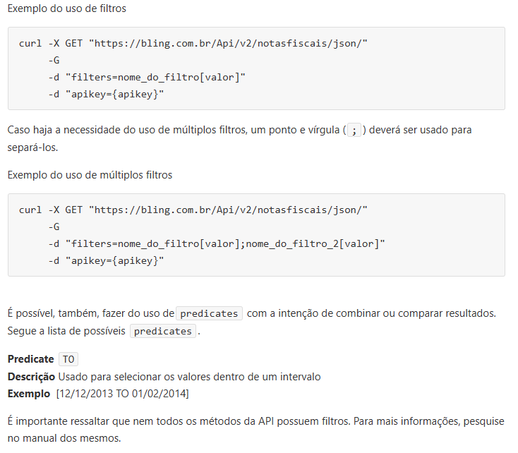
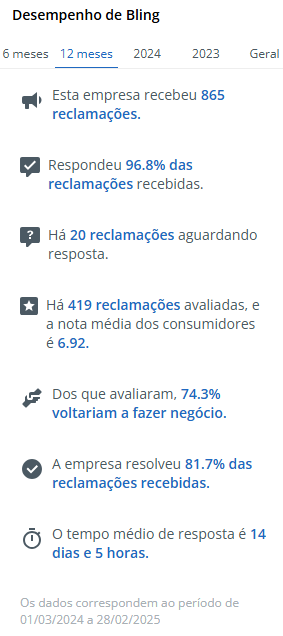
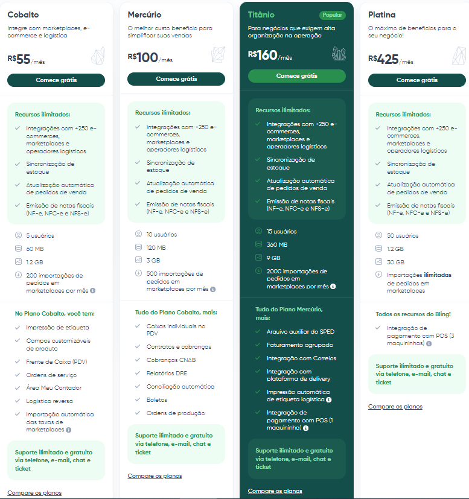

# Bling
- Possui API robusta com endpoint especifico para NF-e
- Possibilidade de criar endpoints personalizados

## Configurações fiscais

- 

    <a href="https://ajuda.bling.com.br/hc/pt-br/categories/360002199413-Notas-Fiscais-e-Tributa%C3%A7%C3%B5es">Configurações fiscais e tributárias do Bling</a>
  

## NF-e
- A API do Bling retorna a nota fiscal em JSON ou XML, então seguiremos o mesmo processo do Tiny para conversão em PDF
    - Será criado um fluxo a partir de requisições HTTP onde retornará os dados da nota fiscal. A frequência de requisição pode ser por agendamento ou por gatilho via webhook a cada nova  nota fiscal criada.
    - Conversão de XML para JSON para extrair o e-mail do cliente e outras informações necessárias
    - Utilização de serviços de terceiros (ConvertAPI) para conversão em PDF.
    - Envio do email
- Bling efetua o cálculo de imposto automaticamente
- A DANFE é enviada em PDF por email junto com o XML da nota
- ***Na emissão automática de notas (após geração em lote), existe a opção para enviar a nota para o cliente após estar autorizada***
- O Bling fornece integração com a Amazon, na qual permite a geração, emissão e envio automático da nota após a importação do pedido de venda

## API
### Endpoint: contas a receber
- Retorna a data de pagamento
- Retorna o link do boleto

### Endpoint: notas fiscais
- Retorna metadados
- Retorna link de rastreamento de envio

### Filtros
- A API do Bling possibilita o uso de filtros no endpoint

  

### Integração do Google Sheets e Bling

- É possível integrar o Bling e o Google Sheets a partir do Pluga. A documentação fornece um passo a passo de como fazer a integração.

## Documentação da API

- https://ajuda.bling.com.br/hc/pt-br/categories/360002186394-API-para-Desenvolvedores

## Pontos negativos observados

*As informações a seguir são referentes a pesquisa no Reclame Aqui*

- Muitas reclamações relacionadas ao suporte no geral, como demora do atendimento ou a qualidade do suporte em si
- Reclamações relacionadas a lentidão do sistema
- Reclamações relacionadas a cobranças indevidas

### Desempenho

*Desempenho no Reclame Aqui no período de 12 meses*

  

      
  

## Referências

- 

    <a href="https://ajuda.bling.com.br/hc/pt-br/categories/360002186394-API-para-Desenvolvedores">Documentação da API</a>
  

- 

    <a href="https://developer.bling.com.br/referencia">Documentação da API - Referência</a>
  

- 

    <a href="https://ajuda.bling.com.br/hc/pt-br/articles/360039127833-Gerar-notas-automaticamente#:~:text=Para%20realizar%20gerar%20as%20notas,salve%20no%20final%20da%20p%C3%A1gina.">Gerar NF-e automaticamente</a>
  

- 

    <a href="https://ajuda.bling.com.br/hc/pt-br/articles/4410990440471-Como-integrar-a-planilha-do-Google-Sheets-ao-Bling-usando-o-Pluga-Integra%C3%A7%C3%A3o-API">Como integrar a planilha do Google Sheets ao Bling usando o Pluga</a>
  

- 

    <a href="https://www.youtube.com/watch?v=cosAshp2O88">Youtube - GOOGLE DOCS: AUTOMAÇÕES PARA O SEU ECOMMERCE (GOOGLE PLANILHA INTEGRADO POR API NO ERP BLING 2.0)</a>
  

- 

    <a href="https://ajuda.bling.com.br/hc/pt-br/articles/360038891333-Como-configurar-o-sistema-para-emitir-notas-de-forma-autom%C3%A1tica">Como configurar o sistema para emitir notas de forma automática?</a>
  

- 

    <a href="https://ajuda.bling.com.br/hc/pt-br/articles/13101706677527-Como-automatizar-a-emiss%C3%A3o-de-notas-fiscais-dos-pedidos-importados-de-lojas-virtuais">Como automatizar a emissão de notas fiscais dos pedidos importados de lojas virtuais</a>
  

## Planos

  

      
  

